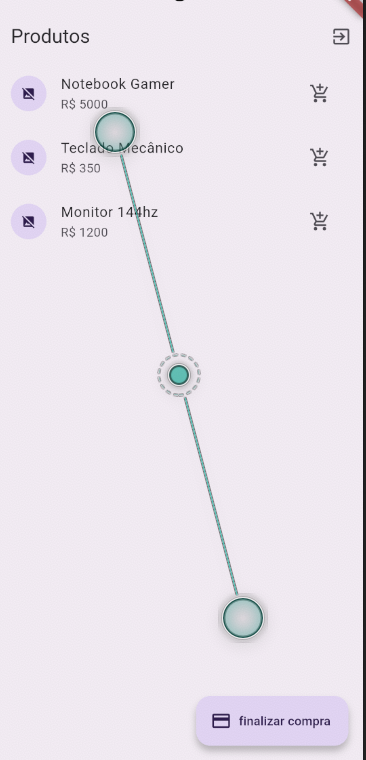
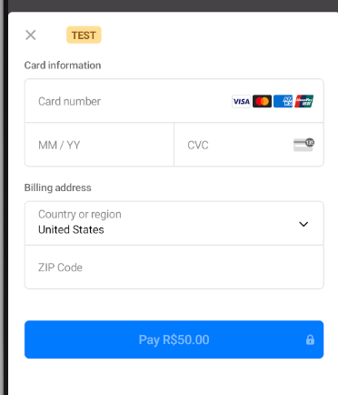
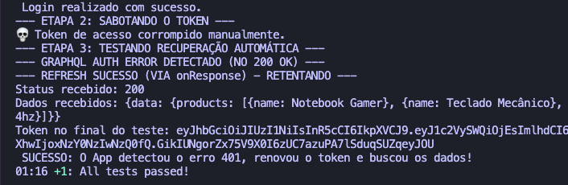
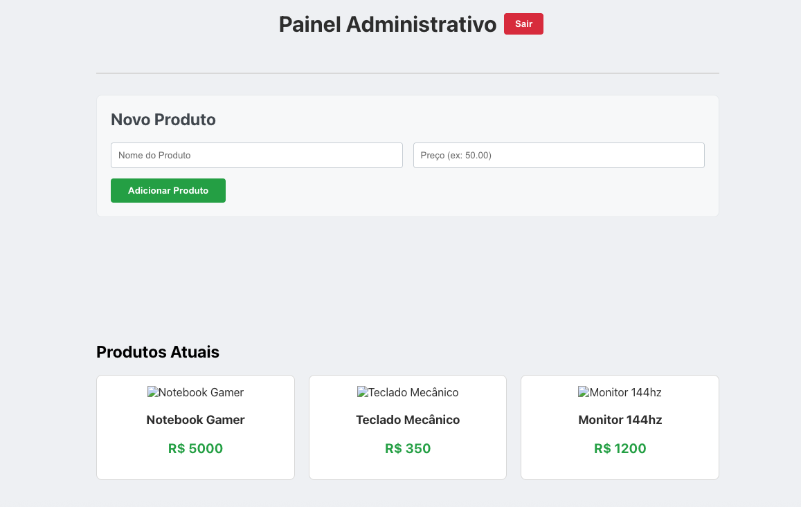
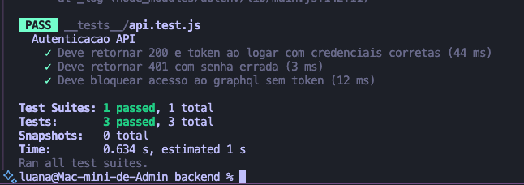

# E-commerce Full Stack Ecosystem (Flutter + React + Node.js)

Desenvolvido por Luana como projeto de estudo avançado em arquitetura Full Stack. linkedin: www.linkedin.com/in/luana-dias-linhares


Um ecossistema completo de E-commerce com arquitetura de software escalável, autenticação e simulação pagamentos. O projeto consiste em um **Backend GraphQL/REST**, um **App Mobile (Flutter)** para clientes e um **Painel Web (React)** para administração.

## Destaques Técnicos

- ** Autenticação Silenciosa (Silent Refresh):** Implementação simples de JWT com `Access Token` e `Refresh Token`. O App Mobile possui interceptadores HTTP (Dio) que detectam tokens expirados (401), renovam a sessão automaticamente e retentam a requisição original sem deslogar o usuário.
- ** Pagamentos Reais:** Integração com **Stripe**. O Backend gera `PaymentIntents` seguros e o Frontend mobile finaliza a transação.

- ** API Híbrida (REST + GraphQL):**
  - **REST:** Usado para autenticação segura e webhooks.
  - **GraphQL:** Usado para busca de dados no catálogo de produtos.
- **Segurança:** validação de tokens no lado do servidor.
- **Testes Automatizados (QA):** Suíte de testes de integração no Flutter que valida fluxos críticos, incluindo a "sabotagem" de tokens para garantir a resiliência da autenticação.

## Tech Stack

### Mobile (Flutter)


- **Gerenciamento de Estado & API:** `Dio` (com Interceptors Customizados), `GraphQL Flutter`.
  
- **Segurança:** `Flutter Secure Storage`.
- **Pagamentos:** `Flutter Stripe`.
  

- **Testes:** `Integration Test`, `Flutter Test`.
  

### Web Admin (React.js)



- **Core:** React Hooks, Functional Components.
- **Dados:** `Apollo Client` (Gerenciamento de Cache e Queries).
- **Estilização:** CSS Modules.

### Backend (Node.js)

- **Server:** Express.js + Apollo Server.
- **Auth:** `JsonWebToken` (JWT).
- **Pagamentos:** Stripe SDK.
- **testes**
  

---

## Como Rodar o Projeto

### Pré-requisitos

- Node.js (v18+)
- Flutter SDK (v3.x)
- Chaves de Teste do Stripe 

### 1. Configurando o Backend

```bash
cd backend
npm install
# Crie um arquivo .env na raiz do backend com as chaves:
# PORT=5000
# STRIPE_SECRET_KEY=sk_test_...
# JWT_SECRET=sua_senha_secreta
# REFRESH_SECRET=sua_senha_refresh
node server.js
```

flowchart TB
subgraph Client Side ["💻 Client Side (Frontend)"]
direction LR
Mobile[("📱 Mobile App<br/>(Flutter + Dio)")];
Web[("🖥️ Web Admin<br/>(React + Apollo)")];
end

    subgraph Backend Side ["☁️ Server Side (Node.js)"]
        direction TB
        API_Gateway["🚧 API Gateway / Express Server"];
        AuthService["🔐 Auth Service<br/>(JWT REST)"];
        GQLService["🚀 Data Service<br/>(GraphQL Resolver)"];
        DB[("🗄️ Database<br/>(Mock/Memória)")];
    end

    External_Stripe{{"💳 Stripe<br/>(Payment Gateway)"}};

    %% --- Fluxos do Mobile ---
    Mobile -- "1. Login/Refresh (REST)" --> AuthService
    Mobile -- "3. Busca Produtos (GraphQL Query)" --> GQLService
    Mobile -- "A. Tokeniza Cartão (HTTPS)" --> External_Stripe

    %% --- Fluxos da Web ---
    Web -- "Login (REST)" --> AuthService
    Web -- "Gerencia Produtos (GraphQL Mutation)" --> GQLService

    %% --- Fluxos Internos do Backend ---
    API_Gateway --> AuthService
    API_Gateway --> GQLService
    AuthService <--> DB
    GQLService <--> DB
    GQLService -- "B. Cria PaymentIntent (API Key)" --> External_Stripe

    %% --- Estilização ---
    classDef client fill:#e3f2fd,stroke:#1565c0,stroke-width:2px;
    classDef backend fill:#e8f5e9,stroke:#2e7d32,stroke-width:2px;
    classDef external fill:#fff3e0,stroke:#e65100,stroke-width:2px,stroke-dasharray: 5 5;

    class Mobile,Web client;
    class AuthService,GQLService,DB,API_Gateway backend;
    class External_Stripe external;
